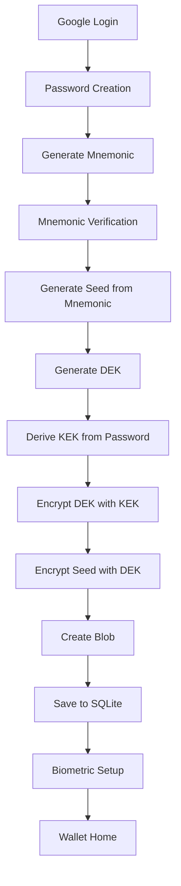
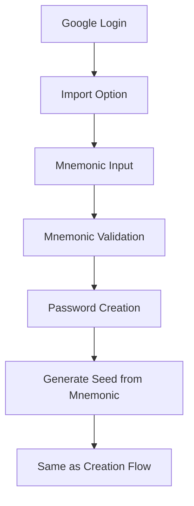
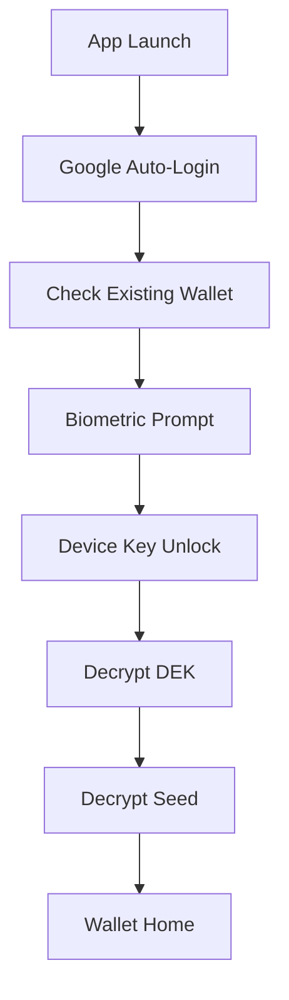
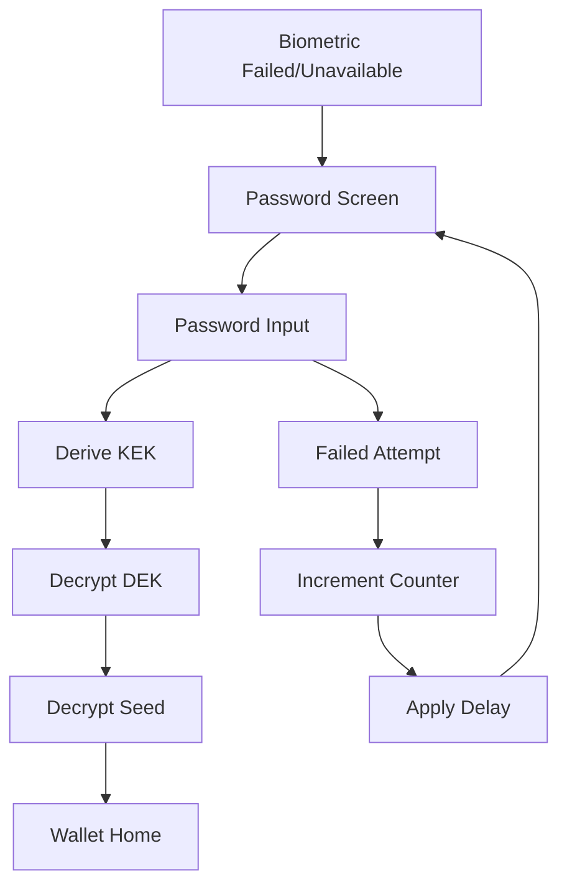

# Non-Custodial Cüzdan Akışı v2 (Flutter + SQLite + Biometric)

Bu doküman, **Google Login sonrası** kullanıcıya ait cüzdanın **client-side şifreleme** ile korunması, **SQLite** veritabanında saklanması, **biometric authentication** ve **mnemonic recovery** akışlarını detaylandırır.

---

## 1. Teknik Detaylar

### Anahtar Boyutları

- **Seed/PrivKey**: 32 byte (ECDSA/Ethereum için secp256k1 privKey).
- **DEK (Data Encryption Key)**: 32 byte (AES-256 key).
- **KEK (Key Encryption Key)**: 32 byte (KDF sonucu).
- **Mnemonic**: 12/24 kelime BIP39 standardı.

### KDF (Key Derivation Function)

- **Algoritma**: Argon2id (Argon2 familyasından hybrid: password hashing için önerilen).
- **Parametreler (mobil optimized)**:
  - memory (`memLimit`): ~1.3 MB (1,331,072 bayt) - mobil cihazlar için optimize edilmiş.
  - iterations (`opsLimit`): 3 (zaman maliyeti).
  - parallelism (`p`): 1 (mobil cihazlarda daha dengeli).
- **Salt**: 32 byte rastgele, sabit, gizli olmayan değer.
- **Neden bu parametreler?**:
  - Düşük memory: Mobil cihazlarda RAM kullanımını minimize eder.
  - 3 iteration: Güvenlik ve performans dengesi.
  - Parallelism=1: Tek çekirdek optimizasyonu.

### AEAD (Authenticated Encryption with Associated Data)

- **Seçilen Algoritma**: `AES-256-GCM`
  - **Nonce**: 12 byte rastgele (GCM standardı).
  - **Auth Tag (MAC)**: 16 byte (ayrı field olarak saklanır).
  - **Avantajları**:
    - Donanım hızlandırması (ARM/Intel AES-NI).
    - Yaygın kullanım ve test edilmiş güvenlik.
    - Flutter crypto kütüphanelerinde iyi destek.
- **Neden AES-256-GCM?**:
  - XChaCha20-Poly1305'e göre daha yaygın donanım desteği.
  - Mobil cihazlarda daha hızlı performans.
  - Endüstri standardı (NIST onaylı).

---

## 2. Güvenlik Methodları

### 2.1 Çift Katmanlı Şifreleme (Double Encryption)

```
Password → KEK (Argon2id) → Wrapped DEK (AES-256-GCM)
DEK → Encrypted Seed (AES-256-GCM)
```

**Neden çift katman?**

- **Key Rotation**: DEK değiştirilebilir, seed sabit kalır.
- **Performance**: Büyük veri DEK ile, küçük DEK KEK ile şifrelenir.
- **Security**: İki farklı şifreleme katmanı.

### 2.2 Biometric Authentication

- **Platform**: Android Keystore / iOS Secure Enclave
- **Uygulama**:
  - DEK ayrıca **device-specific key** ile sarılır.
  - Biometric unlock'ta device key kullanılır.
  - Password bypass edilir ama DEK aynı kalır.
- **Güvenlik**:
  - Biometric data cihazda kalır, sunucuya gönderilmez.
  - Device binding: Başka cihazda biometric çalışmaz.

### 2.3 Brute Force Koruması

- **Failed Attempt Tracking**: SQLite'da deneme sayısı tutulur.
- **Progressive Delay**:
  - 1-3 hata: Anında
  - 4-5 hata: 30 saniye
  - 6+ hata: Exponential backoff
- **Persistent**: Uygulama kapatılıp açılsa da sayaç devam eder.

### 2.4 Mnemonic Verification

- **4 Random Word Challenge**: 12/24 kelimeden rastgele 4 tanesi sorulur.
- **Distractor Words**: BIP39 wordlist'ten sahte seçenekler eklenir.
- **Security**: Brute force'u zorlaştırır, user error'ı azaltır.

---

## 3. Database Schema

### SQLite Tablosu

```sql
CREATE TABLE wallet_blobs (
  user_id TEXT PRIMARY KEY,           -- Google User ID
  blob_json TEXT NOT NULL,            -- Şifrelenmiş wallet blob'u
  created_at INTEGER NOT NULL,        -- Unix timestamp
  updated_at INTEGER NOT NULL         -- Unix timestamp
);
```

### Blob Formatı v2

```json
{
  "version": 1,
  "created_at": "2025-08-17T20:58:23.4883406",
  "kdf": {
    "algorithm": "argon2id",
    "salt": "base64_encoded_32_bytes",
    "iterations": 3,
    "memory": 1331072,
    "parallelism": 1
  },
  "wrapped_dek": {
    "ct": "base64_encoded_ciphertext",
    "nonce": "base64_encoded_12_bytes",
    "mac": "base64_encoded_16_bytes"
  },
  "encrypted_seed": {
    "ct": "base64_encoded_ciphertext",
    "nonce": "base64_encoded_12_bytes",
    "mac": "base64_encoded_16_bytes"
  },
  "metadata": {
    "name": "Keiko Wallet",
    "type": "hd_wallet",
    "coin_type": 60
  }
}
```

**Field Açıklamaları:**

- `version`: Blob format versiyonu (migration için).
- `created_at`: Wallet oluşturulma zamanı.
- `kdf`: Key derivation parametreleri.
- `wrapped_dek`: Password ile şifrelenmiş DEK.
- `encrypted_seed`: DEK ile şifrelenmiş seed.
- `metadata`: Wallet meta bilgileri.

---

## 4. Cüzdan Oluşturma Akışı

### 4.1 Yeni Cüzdan Oluşturma



**Adım Detayları:**

1. **Google Login**: OAuth2 ile kullanıcı kimlik doğrulama.
2. **Password Creation**:
   - Minimum 12 karakter
   - Güçlülük kontrolü (büyük/küçük harf, rakam, özel karakter)
3. **Mnemonic Generation**:
   - BIP39 standardı ile 12 kelime
   - Cryptographically secure random
4. **Mnemonic Verification**:
   - 4 rastgele kelime challenge
   - Distractor words ile multiple choice
5. **Seed Generation**: BIP39 mnemonic → 512-bit seed
6. **Encryption Process**:
   - DEK: 32 byte random key
   - KEK: Argon2id(password, salt)
   - Wrapped DEK: AES-256-GCM(DEK, KEK)
   - Encrypted Seed: AES-256-GCM(Seed, DEK)
7. **Blob Creation**: JSON format ile metadata ekleme
8. **Database Save**: SQLite wallet_blobs tablosuna kayıt
9. **Biometric Setup**: Optional biometric authentication
10. **Wallet Home**: Ana cüzdan ekranına yönlendirme

### 4.2 Cüzdan Import (Recovery)



**Import Özellikleri:**

- 12/24 kelime mnemonic desteği
- BIP39 checksum validation
- Real-time mnemonic validation
- Aynı şifreleme süreci

---

## 5. Cüzdan Açma Akışları

### 5.1 Biometric Unlock (Preferred)



### 5.2 Password Unlock (Fallback)



---

## 6. Hata Durumları ve Güvenlik

### 6.1 Yanlış Parola

- **Detection**: AES-256-GCM MAC verification failure
- **Response**:
  - Failed attempt counter increment
  - Progressive delay application
  - User feedback with retry option

### 6.2 Database Corruption

- **Detection**: SQLite corruption or blob parse error
- **Response**:
  - Backup recovery suggestion
  - Mnemonic recovery option
  - Fresh wallet creation

### 6.3 Biometric Failure

- **Scenarios**:
  - Hardware unavailable
  - Biometric changed
  - Device key corruption
- **Fallback**: Automatic password unlock screen

### 6.4 Device Migration

- **Problem**: Biometric keys device-specific
- **Solution**:
  - Password unlock on new device
  - Re-enable biometric on new device
  - Same wallet blob works across devices

---

## 7. Implementation Detayları

### 7.1 Flutter Packages

```yaml
dependencies:
  # Crypto
  crypto: ^3.0.3
  pointycastle: ^3.7.3

  # Database
  sqflite: ^2.3.0
  path_provider: ^2.1.1

  # Biometric
  local_auth: ^2.1.6
  flutter_secure_storage: ^9.0.0

  # Google Auth
  google_sign_in: ^6.1.5

  # BIP39
  bip39: ^1.0.6
```

### 7.2 Key Services

- **CryptoService**: AES-256-GCM + Argon2id implementation
- **DatabaseService**: SQLite operations
- **BiometricService**: Platform-specific biometric handling
- **WalletCreationService**: Wallet creation/import logic
- **WalletUnlockService**: Unlock and decryption logic
- **GoogleAuthService**: OAuth2 authentication

### 7.3 Security Best Practices

- **Memory Management**: Sensitive data cleared after use
- **Key Storage**: No plaintext keys in memory longer than necessary
- **Error Handling**: Generic error messages (no crypto details)
- **Logging**: No sensitive data in logs
- **Code Obfuscation**: Release builds obfuscated

---

## 8. Performans Optimizasyonları

### 8.1 Argon2id Parametreleri

- **Memory**: 1.3MB (mobil RAM'e uygun)
- **Time**: ~100-200ms (kullanıcı deneyimi için kabul edilebilir)
- **Security**: 2^20 hesaplama maliyeti

### 8.2 Biometric Caching

- **DEK Caching**: Biometric unlock sonrası session boyunca cache
- **Auto-lock**: Background'a geçince otomatik kilit
- **Timeout**: 5 dakika inaktivite sonrası re-auth

### 8.3 Database Optimizasyonları

- **WAL Mode**: Write-Ahead Logging for better concurrency
- **Indexing**: user_id üzerinde primary key index
- **Compression**: JSON blob'lar için minimal format

---

## 9. Güvenlik Analizi

### 9.1 Threat Model

**Korunduğumuz Tehditler:**

- ✅ Device theft/loss (biometric + password protection)
- ✅ Malware (encrypted storage, no plaintext keys)
- ✅ Database dump (encrypted blobs)
- ✅ Brute force attacks (Argon2id + rate limiting)
- ✅ Shoulder surfing (biometric preferred over password)

**Korunamadığımız Tehditler:**

- ❌ Targeted malware with root access
- ❌ Hardware-level attacks (side-channel)
- ❌ User mnemonic compromise
- ❌ Sophisticated social engineering

### 9.2 Security Assumptions

- **Device Security**: User device is not compromised
- **Platform Security**: Android Keystore/iOS Secure Enclave güvenilir
- **Crypto Libraries**: Flutter crypto libraries güvenilir
- **User Behavior**: Mnemonic güvenli saklanır

### 9.3 Compliance

- **GDPR**: User data encrypted, user controls deletion
- **SOC2**: Encryption at rest, access controls
- **Mobile Security**: OWASP Mobile Top 10 compliance

---

## 10. Monitoring ve Logging

### 10.1 Security Events

```dart
// Logged Events (no sensitive data)
- wallet_creation_started
- wallet_creation_completed
- wallet_unlock_attempted
- wallet_unlock_successful
- wallet_unlock_failed
- biometric_enabled
- biometric_disabled
- failed_attempt_limit_reached
```

### 10.2 Performance Metrics

- KDF computation time
- Database operation latency
- Biometric response time
- App launch to wallet ready time

### 10.3 Error Tracking

- Crypto operation failures
- Database corruption events
- Biometric hardware issues
- Network connectivity problems

---

Bu v2 implementasyonu, güvenlik ve kullanıcı deneyimi arasında optimal dengeyi sağlayarak, modern mobil cüzdan standartlarına uygun bir çözüm sunar.
